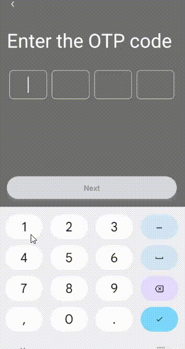

- A react native dynamic component that can be used for OTP's and Pins as secure pin input.

- It comes with a built-in TypeScript typings and is compatible with all popular JavaScript frameworks. You can use it directly or leverage well-maintained wrapper packages that allow for a more native integration with your frameworks of choice.

# Example:



## How to use:

```
import VerificationCodeInput from 'react-native-otp-input-code';

   <VerificationCodeInput
        isSecure={true}
        textContentType="oneTimeCode"
        keyboardType={KeyboardType.number_pad}
        cellCount={4}
        onComplete={checkVerificationCode}
        onChangeText={(value) => {
          if (value.length < 4) {
            resetBoxes();
          }
        }}
        isValid={!isVarificationCodeValide}
        textStyle={{color: "#FFFF"}}
        containerStyle={{borderWidth: 1}}
        errorTextStyle={{color: "red"}}
        errorContainerStyle={{borderColor: "red", borderWidth: 2}}
      />
```

# VerificationCodeInputProps Props :

| Name                 | Type                  |
| -------------------- | --------------------- |
| isValid              | boolean               |
| onComplete           | (val: string) => void |
| onChangeText         | (val: string) => void |
| uppercase?           | boolean               |
| keyboardType         | KeyboardType          |
| cellCount            | number                |
| textContentType      | textInputContentType  |
| textStyle?           | TextStyle             |
| containerStyle?      | ViewStyle             |
| errorTextStyle?      | TextStyle             |
| errorContainerStyle? | ViewStyle             |
| isSecure?            | boolean               |
